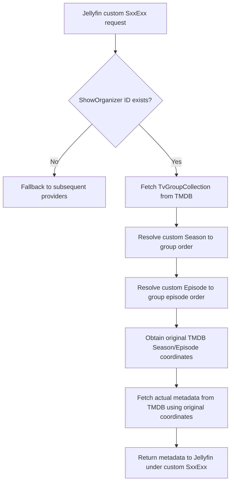

# Architecture Overview

ShowOrganizer is a metadata provider plugin for Jellyfin Server v10.11.11. This document details its architecture, integration with the Jellyfin metadata provider pipeline, and the coordinate resolution process.

## Jellyfin Provider Pipeline

In Jellyfin, metadata lookup is driven by a chain of metadata providers. When Jellyfin refreshes a Series, Season, or Episode, it queries all registered providers in order of their priority (configured in Dashboard -> Libraries -> Metadata settings, or determined by the provider's `Order` property).

1. **Opt-in Interception**: ShowOrganizer providers (`ShowOrganizerEpisodeProvider`, `ShowOrganizerEpisodeImageProvider`, `ShowOrganizerSeasonProvider`) register at the top of the provider list (Episode/Image providers declare `Order => 0`, which runs before the native TMDB providers at `Order => 1`).
2. **Opt-in Verification**: The providers check if the Series has the `ShowOrganizer` ID (`Series.ProviderIds["ShowOrganizer"]`). If not present, they immediately yield and return `HasMetadata = false` so that Jellyfin falls back to the subsequent native metadata providers.
3. **Execution**: If the `ShowOrganizer` ID is present, the provider executes and retrieves metadata using the custom coordinate resolver.

## Exact Episode-Order Resolution

ShowOrganizer maps the user's custom numbering scheme to the official numbering scheme on TMDB using **TV Episode Groups**.

## TMDB Adapter & Caching

The plugin features a decoupled `TmdbClientService` that maintains a private `TMDbClient` instance.

* **API Key**: Read from ShowOrganizer's own configuration (`PluginConfiguration.TmdbApiKey`).
* **Caching**: The retrieved `TvGroupCollection` mappings are cached using the server's shared `IMemoryCache` (injected via dependency injection).
  * Cache key structure: `$"group-{tvShowId}-{groupId}-{language}"`
  * Cache duration: `1` hour.
  * Null or failed responses are never cached.

## Preservation of Custom Numbering

To ensure physical media files do not need renaming and are not misaligned in the user's library:
- ShowOrganizer queries TMDB using the resolved original season/episode numbering coordinates.
- However, the returned metadata properties on the `Episode` item are explicitly assigned to match the original user coordinates:
  - `ParentIndexNumber = info.ParentIndexNumber`
  - `IndexNumber = info.IndexNumber`
  - `IndexNumberEnd = info.IndexNumberEnd`
- As a result, Jellyfin stores the correct episode descriptions, cast, and stills under the user's local custom layout.
