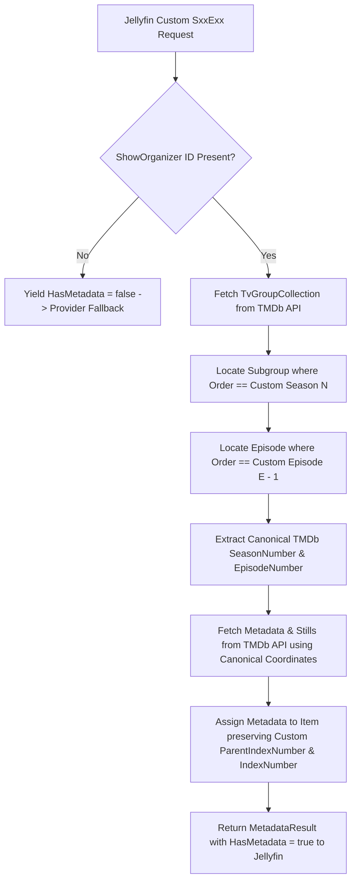
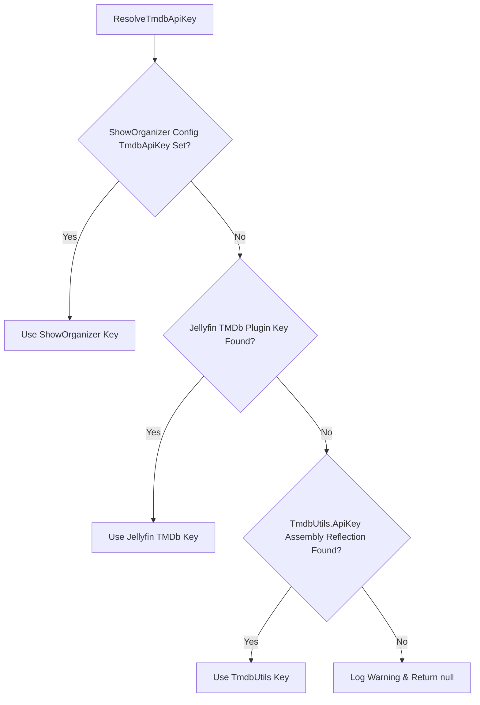

# ShowOrganizer Technical Architecture & System Design

This document serves as the canonical technical reference for ShowOrganizer, a metadata provider plugin for Jellyfin Server v10.11.x (target ABI `10.11.0.0`, verified with Jellyfin `10.11.11`). It documents system design, indexing invariants, provider result semantics, credential priority, and concurrency controls.

---

## A. Purpose and Data Flow

ShowOrganizer allows Jellyfin to organize TV series using custom [The Movie Database (TMDb)](https://www.themoviedb.org/) **Episode Groups** (e.g. Sagas, Story Arcs, or alternative broadcast orders) while fetching canonical metadata from TMDb.

### Coordinate Pipeline



### Coordinate Distinction

1. **Custom / Display Coordinates**: The local season and episode numbers assigned to files by the user in Jellyfin (`ParentIndexNumber`, `IndexNumber`). These remain untouched in the library.
2. **Episode Group Coordinates**: The structural subgroup and episode positions defined inside a TMDb `TvGroupCollection` payload.
3. **Canonical TMDb Coordinates**: The actual `SeasonNumber` and `EpisodeNumber` of the canonical TMDb episode, used strictly for remote TMDb API metadata requests.

---

## B. External IDs

ShowOrganizer registers a custom external identifier with Jellyfin via `IExternalId`:

* **Visible Provider Display Name**: `ProviderName = "TheMovieDb Show Group"`
  Used by Jellyfin's web client and API endpoints to format the user-facing UI label (e.g., *TheMovieDb Show Group Programme Id* or *TheMovieDb Show Group Series Id*).
* **Stable Internal Key**: `Key = "ShowOrganizer"`
  Used as the immutable dictionary key in `Series.ProviderIds["ShowOrganizer"]` and as the NFO XML tag name (`<showorganizerid>`).

> [!IMPORTANT]
> `ProviderName` and `Key` are intentionally decoupled. `ProviderName` may be updated to reflect UI changes without modifying `Key`. `Key` **must remain stable as `"ShowOrganizer"`** to prevent breaking existing database records and NFO files.

Canonical TMDb series IDs remain stored under Jellyfin's standard key: `Series.ProviderIds["Tmdb"]`.

---

## C. Show Group Reference Formats

ShowOrganizer handles two input formats in `ShowOrderReference.TryParse`:

1. **Preferred / Raw Format**: `648fc7202f8d0900e3864f62`
   An un-prefixed TMDb Episode Group ID. Implicitly resolves to provider `tmdb`.
2. **Legacy / Qualified Format**: `tmdb:648fc7202f8d0900e3864f62`
   A prefix-qualified string. Resolved by splitting on the colon prefix (`provider:orderId`).

Parsing in `ShowOrderReference.TryParse` determines reference structure. The parser does not enforce a specific string format or character set on group IDs; validity and existence of the Episode Group are determined later during TMDb API lookup.

### Parsing & Validation Logic (`ShowOrderReference.cs`)

```csharp
public static bool TryParse(string? value, [NotNullWhen(true)] out ShowOrderReference? result)
{
    result = null;
    if (string.IsNullOrWhiteSpace(value))
    {
        return false;
    }

    var cleanValue = value.Trim();

    if (cleanValue.Contains(':', StringComparison.Ordinal))
    {
        var parts = cleanValue.Split(':', 2);
        var provider = parts[0].Trim().ToLowerInvariant();
        var orderId = parts[1].Trim();

        if (string.IsNullOrEmpty(provider) || string.IsNullOrEmpty(orderId))
        {
            return false;
        }

        result = new ShowOrderReference(provider, orderId);
        return true;
    }

    result = new ShowOrderReference("tmdb", cleanValue);
    return true;
}
```

---

## D. EXACT MAPPING INVARIANTS

> [!CAUTION]
> **CRITICAL REGRESSION WARNING**: Do NOT "normalize" both season and episode indexes to 0-based or 1-based. TMDb Episode Group subgroup orders and episode orders use different indexing bases by design.

The exact mapping invariants verified against real TMDb Episode Group payloads are:

$$\text{Custom Season } N \longrightarrow \text{TMDb Subgroup where } \texttt{Order} == N \quad \text{(1-based)}$$

$$\text{Custom Episode } E \longrightarrow \text{Subgroup Episode where } \texttt{Order} == E - 1 \quad \text{(0-based)}$$

### Code Implementations

* **Season Mapping (`ShowOrganizerSeasonProvider.cs`)**:
  ```csharp
  var matchingGroup = groupCollection.Groups.Find(g => g.Order == customSeasonNumber.Value);
  ```
* **Episode Mapping (`TmdbExactOrderResolver.cs`)**:
  ```csharp
  var season = groupCollection.Groups.Find(s => s.Order == customSeasonNumber);
  var episode = season.Episodes.Find(e => e.Order == customEpisodeNumber - 1);
  ```

---

## E. Canonical Episode Resolution

Once an episode is located in the TMDb Episode Group payload, its canonical TMDb coordinates (`episode.SeasonNumber`, `episode.EpisodeNumber`) are passed to `client.GetTvEpisodeAsync(...)`.

When returning the constructed `Episode` object to Jellyfin, the original custom coordinates from `EpisodeInfo` are strictly preserved:

```csharp
var item = new Episode
{
    IndexNumber = info.IndexNumber,
    ParentIndexNumber = info.ParentIndexNumber,
    IndexNumberEnd = info.IndexNumberEnd,
    Name = episodeResult.Name,
    Overview = episodeResult.Overview,
    PremiereDate = episodeResult.AirDate,
    ProductionYear = episodeResult.AirDate?.Year,
    CommunityRating = Convert.ToSingle(episodeResult.VoteAverage)
};
```

---

## F. Provider Result / Fallback Semantics

ShowOrganizer providers implement standard Jellyfin provider contracts (`IRemoteMetadataProvider<Season, SeasonInfo>`, `IRemoteMetadataProvider<Episode, EpisodeInfo>`, and `IRemoteImageProvider`).

When metadata cannot be resolved, ShowOrganizer returns `HasMetadata = false` (`Item = null`) or `Enumerable.Empty<RemoteImageInfo>()`, allowing Jellyfin's `ProviderManager` to fall back to the next configured metadata provider:

| Scenario | Behavior / Return Value | Logging Level |
| :--- | :--- | :--- |
| **No ShowOrganizer ID on Series** | `HasMetadata = false`, `Item = null` | Silent |
| **No TMDb Series ID on Series** | `HasMetadata = false`, `Item = null` | Silent |
| **Neither ID Present** | `HasMetadata = false`, `Item = null` | Silent |
| **Malformed Show Group ID** | `HasMetadata = false`, `Item = null` | `WARN` |
| **Unsupported Provider Prefix** | `HasMetadata = false`, `Item = null` | `WARN` |
| **Group / Subgroup Not Found** | `HasMetadata = false`, `Item = null` | `WARN` (deduplicated) |
| **Unmappable Custom Coordinate** | `HasMetadata = false`, `Item = null` | `WARN` (deduplicated) |
| **TMDb API Network / HTTP Error** | `HasMetadata = false`, `Item = null` | `WARN` |
| **Valid Mapping** | `HasMetadata = true`, `Item = Episode/Season` | `INFO` (activated once per show) |

---

## G. TMDb Credential Resolution

`TmdbClientService.ResolveTmdbApiKey()` resolves TMDb API credentials according to the following strict priority:

1. **Explicit Plugin Override**: Checks `Plugin.Instance?.Configuration?.TmdbApiKey`.
2. **Jellyfin TMDb Plugin Configuration**: Inspects Jellyfin's `IPluginManager.Plugins` for active TMDb plugin configuration (`TmdbApiKey` property).
3. **Jellyfin Assembly Fallback**: Inspects loaded assemblies via reflection for `MediaBrowser.Providers.Plugins.Tmdb.TmdbUtils.ApiKey`.



---

## H. Series Eligibility Evaluation & Warning Deduplication

To provide clean separation of validation logic without overhead, `ShowOrganizerEligibilityEvaluator` evaluates series configuration state statelessly on every invocation without caching eligibility result objects:

* **Evaluation States**:
  1. `Inactive`: No `ShowOrganizer` ID configured. ShowOrganizer cleanly declines.
  2. `InvalidMissingTmdbId`: `ShowOrganizer` ID present, but canonical `Tmdb` series ID missing/invalid.
  3. `InvalidReference`: `ShowOrganizer` value malformed.
  4. `UnsupportedProvider`: Legacy provider prefix is not `tmdb`.
  5. `Eligible`: Valid `ShowOrganizer` group ID and `Tmdb` series ID present.
* **Stable Series Identity**:
  To ensure warning deduplication operates at the series level across episodes while supporting multiple cuts/editions:
  * Filesystem path resolution extracts the series root directory (`PATH:{seriesDirectory}`), stripping season subfolders (`Season 01`, `Season 02`, `Specials`).
  * External provider IDs (`PIDS:{providerIds}`) or Jellyfin internal series GUID (`GUID:{seriesGuid}`) are used when available.
  * Series display name (`NAME:{name}`) acts as a fallback.
* **Warning Deduplication Key**:
  ```
  SERIES:{stableSeriesIdentity}|{WARNING_TYPE}|SO:{cleanShowOrganizerId}|TMDB:{cleanTmdbId}
  ```
  Warnings for user-correctable configuration problems are logged **once per series + configuration state** (`_loggedWarnings`). Updating series configuration in Jellyfin generates a new key fingerprint, enabling immediate re-evaluation without plugin restarts.

---

## I. Episode Group Caching & Request Coalescing

`TmdbClientService` manages Episode Group payload lifecycle to optimize library scan performance:

1. **Positive Caching**:
   * **Cache Layer**: Shared `IMemoryCache`.
   * **Key Format**: `group-{tvShowId}-{groupId}-{normalizedLanguage}`
   * **Duration**: 1 hour (`TimeSpan.FromHours(1)`).
   * **Condition**: Cached when TMDb API returns a valid `TvGroupCollection` containing groups.
2. **Negative Caching (Definitive Not-Found Only)**:
   * When TMDb API explicitly returns a null/not-found group response without throwing transport exceptions, the result is stored in `_negativeGroupCache` (`neg-group-{tvShowId}-{groupId}-{normalizedLanguage}`) with a **10-minute TTL** (`TimeSpan.FromMinutes(10)`).
   * A `Warning` log is emitted **once** per group configuration state.
   * Temporary network/transport exceptions (`HttpRequestException`, timeouts) are **not** negative-cached, allowing immediate retries upon network recovery.
3. **In-Flight Request Coalescing**:
   * `_inFlightGroupRequests` (`ConcurrentDictionary<string, Task<TvGroupCollection?>>`) tracks active TMDb API requests. Parallel episode queries for the same series group share a single in-flight TMDb API call using identical key dimensions (`tvShowId`, `groupId`, `normalizedLanguage`).

---

## J. Logging Classification Policy

ShowOrganizer uses standard `ILogger` levels across all builds (including production Release binaries):

| Level | Usage / Scenarios |
| :--- | :--- |
| **`Information`** | Major plugin lifecycle events (plugin startup/shutdown) and once-per-series activation notices. |
| **`Warning`** | User-correctable configuration issues (missing TMDb ID, malformed group ID, unsupported provider prefix, non-existent TMDb group ID). Deduplicated per series configuration state. |
| **`Error`** | Genuine unexpected runtime exceptions, network transport failures, or server errors. |
| **`Debug`** | High-frequency operational tracing: per-episode provider invocation, TMDb group retrieval attempts/results, cache hits/misses, request coalescing, custom $\rightarrow$ canonical coordinate mapping, individual unmappable episodes, fallback decisions. Enabled via category override `"Jellyfin.Plugin.ShowOrganizer": "Debug"`. |

---

## K. Cancellation & Exception Handling

* **Caller-Requested Cancellation**: Operations inspect `CancellationToken` (e.g. `cancellationToken.ThrowIfCancellationRequested()`). `OperationCanceledException` is caught with `when (cancellationToken.IsCancellationRequested)`, logged at `Debug` level, and rethrown (`throw;`). It is not logged as an `Error` or treated as a TMDb failure.
* **TMDbLib Exception Contract**: `TMDbClient` is initialized with `ThrowApiExceptions = false`. TMDb API HTTP 404 (Not Found) responses return `null` cleanly without throwing exceptions, triggering the single-warning negative-cache path.

---

## L. Multiple Cuts / Editions

Multiple custom cuts or fan-editions of a series (e.g. *Dragon Ball Recut*, *Dragon Ball Z Kai Saga Order*, etc.) can:
* Share the same canonical TMDb Series ID (`Series.ProviderIds["Tmdb"]`).
* Share canonical TMDb Episode IDs.
* Use different TMDb Episode Group IDs in `Series.ProviderIds["ShowOrganizer"]`.

ShowOrganizer preserves custom season/episode numbering per library item and uses filesystem folder path resolution in warning keys, allowing distinct custom structures to coexist cleanly in Jellyfin.

---

## M. Artwork Limitation

TMDb Episode Group endpoints (`TvGroupCollection` and `TvGroup`) provide subgroup ordering and saga names, but do **not** supply dedicated subgroup/saga poster artwork in TMDb's API schema. ShowOrganizer does not fabricate poster artwork mappings; custom saga posters should be supplied via local files (`season01.jpg`) or complementary image providers.

---

## N. NFO & Persistence

Jellyfin's native NFO saver serializes external IDs into XML based on `IExternalId.Key`:
* Key `"ShowOrganizer"` $\rightarrow$ `<showorganizerid>` element in `tvshow.nfo`.
* Preferred payload: raw Episode Group ID (e.g. `<showorganizerid>648fc7202f8d0900e3864f62</showorganizerid>`).
* Legacy payload: `<showorganizerid>tmdb:648fc7202f8d0900e3864f62</showorganizerid>`.

Jellyfin automatically parses `<showorganizerid>` into `Series.ProviderIds["ShowOrganizer"]` during library scans.

---

## O. Jellyfin Version & API Assumptions

* **Target ABI**: `10.11.0.0`
* **Verified Runtime**: Jellyfin `10.11.11` (.NET 9.0)
* **Core Interfaces Utilized**:
  * `MediaBrowser.Controller.Providers.IExternalId`
  * `MediaBrowser.Controller.Providers.IRemoteMetadataProvider<TItemType, TLookupInfo>`
  * `MediaBrowser.Controller.Providers.IRemoteImageProvider`
  * `MediaBrowser.Controller.Plugins.IPluginServiceRegistrator`

---

## P. Plugin Lifecycle & Service Registrations

* **Service Registrations**: `PluginServiceRegistrator` registers `ShowOrganizerEligibilityEvaluator`, `TmdbClientService`, and `TmdbExactOrderResolver` in Jellyfin's `IServiceCollection`.
* **Service Disposal**: `TmdbClientService` implements `IDisposable` to dispose internal `TMDbClient` resources.
* **Shutdown & Assembly Unload Safety**: `Plugin` implements `IDisposable` to handle explicit plugin unload cleanup:
  * Resets `Plugin.Instance = null`.
  * Invokes `ShowOrganizerEligibilityEvaluator.ResetState()` to clear static warning deduplication dictionaries.
  * Invokes `ShowOrganizerEpisodeProvider.ResetState()` to clear activation dictionaries.
  * Invokes `TmdbClientService.ResetState()` to clear negative group cache and in-flight request tracking.
